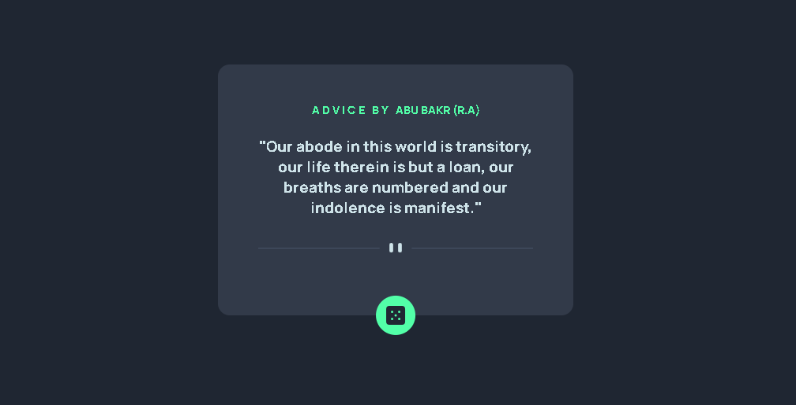

🎲 Advice Generator App : 

Welcome! This is my first project working with Third-Party APIs! This app provides random pieces of wisdom at the click of a button. 💡

🚀 Live Demo : 

Live Site : [# https://mansityagi548.github.io/random-advice/]

Preview : 

✨ Features:

->Dynamic Content: Fetches real-time quotes and data from the DummyJSON API. 

->Modern JavaScript: Implemented using async/await and the fetch API for clean, readable code.

->Responsive Layout: Fully optimized for mobile and desktop screens 📱💻.

->Accessibility First: Integrated ARIA labels and Live Regions so the updates are announced to screen readers ♿.

->Clean UI: Used HSL color variables and Flexbox for a pixel-perfect design.

🛠️ Built With:

->HTML5 - Semantic elements like <main>

->CSS3 - Custom properties, Flexbox, and transitions for the hover effects.

->JavaScript - Logic for fetching data and handling the DOM.

->Google Fonts - Styled with the "Manrope" typeface.

🧠 What I Learned: 

->This project helped me master several fundamental web development concepts:

->The Fetch API: Understanding how to request data from a server and wait for a response.

->Logic & Error Handling: Using if (!response.ok) and try...catch to make sure the app doesn't crash if the API is down.

->Async Functions: Learning why we use async and await to handle tasks that take time to complete.

📂 How to Run Locally:

1. Clone the repository:
   git clone https://github.com/mansityagi548/random-advice.git

2.Open index.html in your browser!

